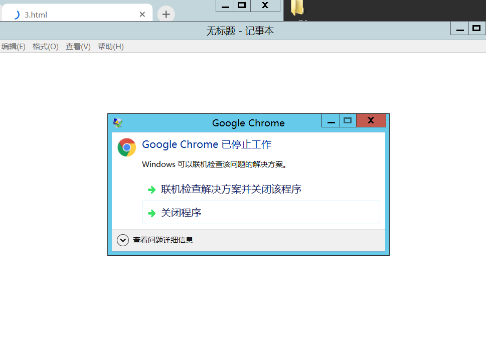
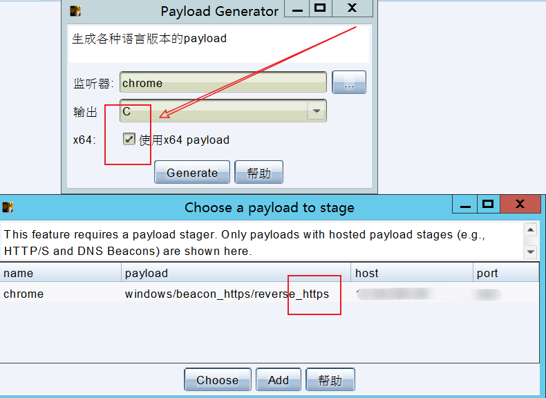
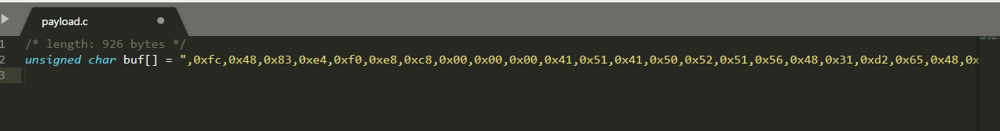
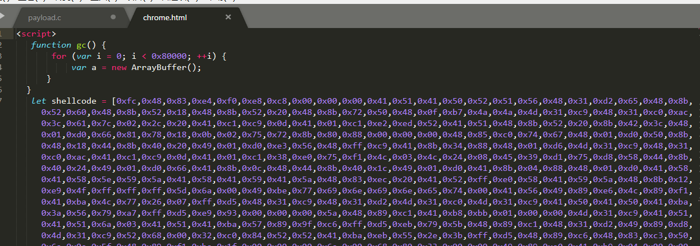
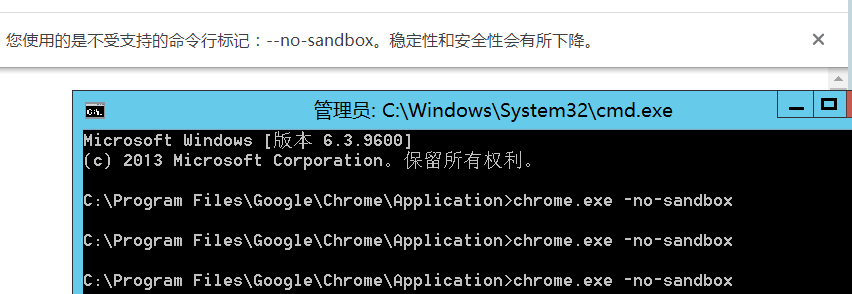
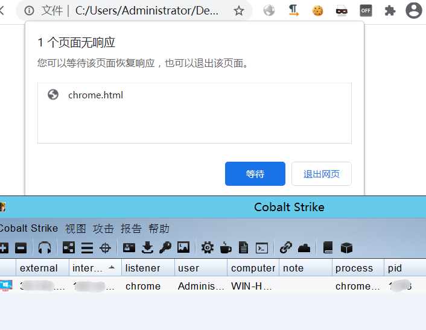

# Cobalt Strike 利用 Chrome-0day 上线
## Chrome-0day 漏洞介绍
Google Chrome是由Google开发的免费网页浏览器。经测试，此漏洞影响 Chrome 最新正式版（89.0.4389.128）以及基于Chromium内核的Microsoft Edge正式版（89.0.774.76）。攻击者可通过构造特制web页面并诱导受害者访问来利用此漏洞获得远程代码执行。

Chrome一直是很多用户使用的浏览器，最新出来了一个Chrome 0Day ，然后我这边已经成功复现，配合这个0day，可以执行任意命令，不过前提条件是需要chrome开启--no-sandbox无沙盒模式，我们可以生成一个链接让受害者点击直接上线Cobalt Strike。

## 影响范围

Google Chrome <= 89.0.4389.128

基于Chromium内核的Microsoft Edge <= 89.0.774.76

其他基于V8引擎的浏览器

目前90.0.4430.72 (正式版本)也受影响。

但最新版90.0.4430.85 (正式版本)不受影响。

目前测试32位Chrome所有版本都不受影响。

## 利用 Chrome-0day 上线 Cobalt Strike

### 1.首先尝试弹出记事本，成功说明存在漏洞利用  

### 2.CS开启监听  
  
2.1 生成pyload，https的稳定，勾选x64  

2.2 生成之后获得pyload.c  
 
2.3 将shellcode的\`\\\`全部替换为\`,0\`然后取出来shellcode  放入 chrome 0day 中  

2.4 复制出来 放入 POC 中 第7行 给shellcode  赋值数组，保存 成 chrome.html  

2.5 执行以下命令，关闭沙箱并打开谷歌浏览器
```
cd C:\\Program Files\\Google\\Chrome\\Application\\
chrome.exe \-no-sandbox
```

2.6 然后双击打开chrome.html，cs成功上线  
  

## 注：本实验不得用于商业用途,仅做学习交流，如用作他途造成的一切后果请自行承担!

## [Chrome-0day ShellCode 传送门](https://github.com/AeolusTF/chrome-0day.git)
